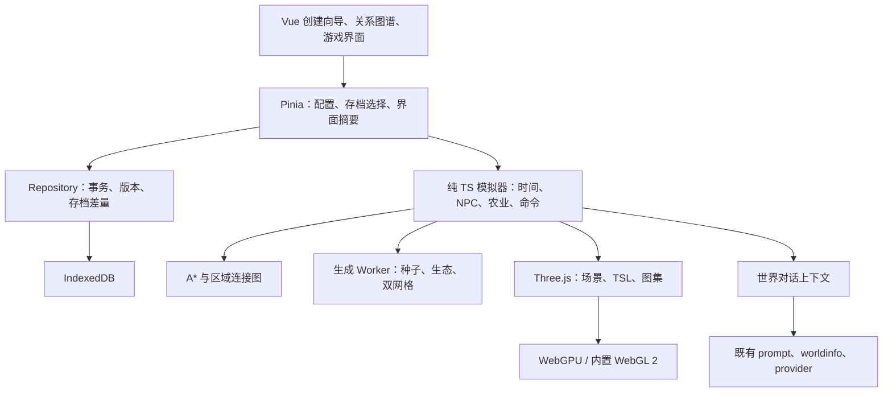

# 无限世界模块：项目调研与实施方案

更新：2026-09-15。范围：需求分析、技术选型、接入设计和分期验收；本文中的模块与数据结构为待实现方案。

## 1. 建议采用的整体方案

在现有角色扮演应用中新增独立的“无限世界”模块，采用 **Vue 配置界面 + 手绘 2.5D 世界 + 纯 TypeScript 生活模拟**。

玩家先配置世界观、身份、NPC 和关系图谱，再进入由种子生成的城镇、田野、野外、森林与河流。玩法先完成“出门探索 → 采集/种植 → 与居民互动 → 睡眠推进一天”的循环。NPC 按职业与日程生活，关系影响互动，聊天使用现有角色卡和提示词引擎。

技术职责明确划分：

| 技术 | 负责内容 |
| --- | --- |
| Three.js / WebGPURenderer | 正交相机、场景、图集精灵、实例化绘制、WebGPU 与 WebGL 2 后端 |
| TSL / NodeMaterial | 草叶风动、水面扰动、材质混合、昼夜调色 |
| simplex-noise + 固定种子 PRNG | 高度、湿度、植被密度、地表变化和河道扰动 |
| 双网格 | 地块边界的 16 种连接形态、河岸/道路/草地衔接 |
| A* + 区域连接图 | 玩家与 NPC 寻路；噪声可影响地形代价，路径由寻路算法求解 |
| 纯 TS 模拟器 | 时钟、作物、库存、NPC 日程、关系变化和事件 |
| 现有 provider / prompt 引擎 | NPC 对话和可选的高层行动意图 |

“无限”指按需生成、持续探索和卸载远处区块。第一版采用单机本地存档，明确数值范围和存储配额；多人同步运行不纳入第一版。

## 2. 项目现状与具体接入点

以下结论来自当前工作区源码，历史设计文档与源码不一致时以源码为准。

| 现有能力 | 已核验情况 | 本模块接入方式 |
| --- | --- | --- |
| 前端框架 | Vue 3.5、TypeScript 6、Vite 8、Pinia、idb | 保持 views/components → stores → services/repositories 分层 |
| 角色库 | [character.ts](../src/types/character.ts) 支持 Character Card V2、立绘、性格、场景、世界书 | 作为 NPC 模板候选池；创建世界时生成独立实例与快照 |
| 用户身份 | [settings.ts](../src/types/settings.ts) 的 PersonaSettings 有名称、描述和头像，没有独立职业字段 | 预填世界内身份；新增身份/职业、目标、出生点等字段 |
| 关系图谱 | [RelationGraph.vue](../src/components/group/RelationGraph.vue) 已支持用户节点、有向边、拖拽、连线、编辑、交换方向 | 复用 SVG 交互和 graphGeometry，抽取通用图谱契约 |
| 关系数据 | [group.ts](../src/types/group.ts) 仅有 label、desc、节点布局，没有好感/信任数值 | 世界内新增关系状态；保留群聊原有契约的兼容适配 |
| 世界知识 | [worlds.ts](../src/stores/worlds.ts) 与 worldinfo 引擎已支持世界书多来源扫描 | 复用世界观内容和规则扫描；另存游戏运行状态 |
| 对话 | [builder.ts](../src/services/prompt/builder.ts)、[generation.ts](../src/stores/generation.ts) 已提供身份宏、关系文本、记忆和提示词预算 | 增加世界会话绑定与上下文适配；预览和实际生成共用入口 |
| 路由 | [router/index.ts](../src/router/index.ts) 的 /worlds 已是世界书 | 新模块采用 /game-worlds、/game-worlds/new、/game-worlds/:worldId |
| 本地存储 | [schema.ts](../src/db/schema.ts) 的 DB_VERSION = 5；v5 删除旧 rpgworlds | 在下一结构版本新增 stores，延续旧迁移阶梯 |
| 历史数据清理 | [migrations.ts](../src/db/migrations.ts) 的 DATA_SCHEMA_VERSION = 2；删除旧 chat_metadata.rpg | 新会话绑定命名为 infiniteWorld；不复用失效的 rpg 字段 |
| 备份和扫码 | [backup.ts](../src/services/io/backup.ts)、[sync/session.ts](../src/services/sync/session.ts) 使用显式类别清单 | 新增世界数据时必须同步扩展清单、协议、统计和恢复流程 |
| Three.js | 本地 three = 0.186.0，@types/three = 0.185.4；已有立绘视差 WebGLRenderer | 新游戏渲染器独立生命周期，按路由懒加载；先验证类型版本匹配 |
| simplex-noise | package.json / lockfile 已声明并锁定 4.0.3；源码使用 `createNoise2D` | 继续固定版本与种子 PRNG；生成器升级必须递增 `generatorVersion` |
| 资产与平台 | public 中未发现可用游戏图集；当前工程未发现 src-tauri / Cargo.toml | 需要制作手绘资产；先以 Web 应用验证，桌面壳兼容性另测 |

需要保留的工程约束：

- services 和 db 不引入 Vue/Pinia；运行时通过接口向界面发布状态。
- 编辑草稿与持久化使用 `toPlain()`。它会原样保留 TypedArray，因此需要冻结运行时快照时还要复制对应缓冲区。
- IndexedDB 事务内只 await IDB 请求。生成地图、读取网络资源、解码图片、解压备份都在事务外完成。
- 当前 App 的 KeepAlive 包含角色页；游戏进入/离开时需协调现有立绘视差渲染，避免后台帧循环继续争用 GPU。

## 3. 两张参考图的美术结论

已直接查看：

- `C:/Users/25925/Downloads/sjt.png`：完整场景，包含木屋、暖色土路、蓝绿树冠、柔和投影和中央小角色。
- `C:/Users/25925/Downloads/ScreenShot_2026-09-15_092055_282.png`：植被近景，草丛覆盖层次更丰富，可见浅水/湿地区域、倒影效果、小花与手绘树形。

目标是 **带清晰描边、柔和色块与草叶笔触的绘本式俯视场景**。静态截图能确认表现形式，不能据此确认原作品使用的引擎或光照算法。

### 3.1 视觉特征与实现对应

| 参考特征 | 实现建议 |
| --- | --- |
| 地面俯视，同时能看见角色、树干、房屋正面 | 正交相机，固定斜俯视角；原型从相对地面约 50°–60°试拍，用截图校准；不强制 45°等距菱形布局 |
| 深绿/灰褐描边，线条带绘制感 | 描边优先画进角色、树木、房屋图集；减少依赖统一屏幕后处理描边 |
| 橄榄绿草地、暖赭土路、蓝绿树冠、蜂蜜色木屋 | 制作统一调色板；可用 #718153、#C98F5D、#5F8790、#A87545 作为初始近似值，最终以并排截图校色 |
| 大色块上覆盖成簇草叶和稀疏小花 | 地表底色 + 草纹图集 + 稀疏装饰实例；噪声控制疏密、聚簇和变体 |
| 路边细碎草齿、圆润转角、自然河岸 | 双网格边界图集/遮罩，独立配置内角、外角、窄连接与装饰边 |
| 小头身比的可爱角色、脚底清晰 | 四向待机/行走精灵，统一脚底锚点；头像和人物立绘继续用于对话面板 |
| 长而柔和的树影、窗户暖光 | 绘制/投射简化软阴影、局部发光贴片；昼夜以环境调色叠加，避免重复烘焙光照 |
| 湿地半透明色层、轻微倒影 | 分离湿地与深水；水面遮罩 + 小幅 UV 扰动；近处可加简化倒影层 |
| 树冠和高草形成遮挡 | 以脚底位置参与对象排序；树冠/树干分层，角色被大面积遮住时局部淡化 |

推荐 **三维地表与碰撞坐标 + 手绘 2D 图集对象**。角色卡立绘无法直接充当四向行走动画，第一版提供统一风格的行走形象供选择，角色原图用于头像与聊天。角色和 NPC 的每帧锚点、尺寸、朝向必须一致。

河流与湿地在逻辑上分别表示：浅水可缓行，深水阻挡，桥梁提供通行连接。透明视觉本身不决定能否走过去。

### 3.2 资源与渲染规范

建议从一套春季资产开始：草地/泥土/耕地/水岸过渡、两类阔叶树、一类针叶树、灌木/花/石、木屋与桥、一个四向玩家形象和三套 NPC 外观。

资源清单记录 assetId、atlas、frame、pivot、collisionFootprint、drawLayer、seasonVariants；房屋另有门口、交互点和占地，树木另有树干碰撞与树冠遮挡范围。程序随机缩放/翻转只应用于允许变换的资产，避免屋门、光影和角色朝向出错。

图集设置边缘扩展和透明留白，解决采样串色。手绘图集优先平滑采样；按图集尺寸与缩放测试 mipmap，避免描边远处变糊。建筑资源通过清单按需加载，立绘不作为场景内全分辨率贴图。

GPU 主要负责颜色混合、风和水波；植被实例按 chunk、材质与图集分批。对不透明裁切、半透明水面和角色排序分别设计绘制顺序，先验证草丛、倒影、树冠不会产生穿插错误。

## 4. 创建世界之前的配置流程

采用五步向导，允许返回修改。草稿独立保存，最后确认并通过地图连通性检查后，才原子创建正式世界与初始存档。

| 步骤 | 用户配置 | 校验与默认行为 |
| --- | --- | --- |
| 世界观 | 名称、世界背景、时代、基调、社会规则、魔法/科技边界、世界书、生态偏好 | 名称和核心背景必填；提供田园模板；导入世界书展示来源 |
| 玩家身份 | 名称、身份/职业、经历、目标、外观、出生地点、初始资源 | 从 persona 复制初值，修改仅影响本世界；出生点必须可通行 |
| NPC | 选已有角色或创建世界内居民；职业、家、工作点、活动偏好、日程模板、外观 | 为每位居民分配独立 npcId；缺角色库时可使用基础居民模板 |
| 关系图谱 | 玩家↔NPC、NPC↔NPC；关系标签、说明、方向、初始好感/信任 | 同名角色按 ID 区分；禁止悬空边和误建自连接；删除居民同步清理草稿关系 |
| 地图预览 | 种子、城镇密度、森林覆盖、水域比例、初始季节、一天时长 | 使用正式生成器预览；显示家、田地、商店、桥和 NPC 目的地；可复现同一结果 |

NPC 选择这一步提供三名居民的推荐组合，也允许用户主动创建无居民的沙盒世界。创建流程不以配置模型服务为前提。

世界观采用“叙事文本 + 可执行规则”双层配置。例如“雨天商店晚开门”需要对应营业规则；“禁止魔法”影响对话约束与可用行动类型。任意自然语言设定不会自动变成游戏机制，支持的规则需要在界面中明示。

### 4.1 关系图谱如何复用

现有 RelationGraph 的输入已接近通用图谱，但类型引用 GroupRelation，且编辑器会直接修改传入边对象。建议：

1. 提取通用 Node / Edge / Layout 到 types/relationGraph.ts，保留群聊适配层。
2. 通用画布以选择节点、选择关系、创建边、更新边、更新布局等事件交给父组件管理草稿。
3. 世界关系编辑器在侧面板展示标签、说明、好感（-100～100）和信任（0～100）；画布显示方向和标签，并支持关系列表作为键盘/小屏操作入口。
4. 玩家节点继续通过适配兼容现有 USER_NODE_ID；NPC 节点使用世界实例 npcId，不能直接用 sourceCharacterId。
5. 世界模板保存初始关系，存档保存当前关系。关系变化由事件产生，图谱节点坐标只影响排版。

例：NPC A→玩家“戒备、信任 20”，玩家→NPC A“合作伙伴”；A 与 B 的关系也可独立配置。聊天只传当前交互所需关系，私人信息按角色知情范围筛选。

## 5. 第一版的玩法闭环

第一版至少能完整体验一个游戏日：

1. 从家门口出发，步行进入城镇、农田、森林与河岸。
2. 拾取野外资源，开垦/播种/浇水；背包与体力发生可见变化。
3. 在营业时间买种子或出售收获；库存和货币有一致的数量变化。
4. 看到居民从家出发去工作、社交、回家；靠近后交谈或赠礼。
5. 睡眠推进日期，按浇水、季节和生长阶段结算作物，保存后重新打开仍能继续。

建议默认一天约 20 分钟，可配置；菜单和对话默认暂停游戏时间，切到后台也暂停。渲染帧率、模拟步长、游戏时钟分别管理。睡眠跳时按事件时间结算，不逐帧快进。

首版田园规则只包含少量作物、采集物和商店商品。钓鱼、畜牧、矿洞、复杂建造、婚恋剧情、节庆任务放入扩展阶段。

## 6. 双网格与程序化生成

### 6.1 双网格的确切定义

采用 **逻辑网格 + 相对偏移半格的显示网格**：

- 逻辑格存储地表类型、通行代价、占地、耕作状态和高度信息。
- 显示格读取四个相邻逻辑格，以统一角点顺序编码边界。
- 对某一二值地表层，`mask = NW + 2 × NE + 4 × SE + 8 × SW`，得到 0～15 共 16 种形态，映射到边界图集或遮罩几何。
- 对交错对角形态 5/10 固定连接规则；连续标量层可采用中心值判定，离散地块使用统一模板。视觉连接和寻路规则一起验证。
- 多种生态按层组合：基础草地 → 湿土/水体 → 土路/耕地 → 装饰。16 种形态对应单个二值层，不是全部生态混在一起只需 16 张图。

双网格负责地块衔接；完整的地貌、道路规划和生态分布由生成器另外计算。道路中心线或河流中心线可以用 spline 表达，再栅格化进逻辑网格，显示与碰撞共用同一结果。

每块从 32×32 逻辑格起步，边界至少读取邻块一圈采样；计算法线、宽河岸等更大邻域操作时增加 halo。块只负责自己的几何与实体，边缘装饰按全局锚点归属，避免树木重复。

### 6.2 可复现的生成流水线

1. **种子派生**：保存世界种子、generatorVersion、PRNG 版本、noise 版本和生成参数。高度、湿度、植被、聚落使用独立随机流，禁止使用 Math.random 或共享会随调用顺序变化的随机序列。
2. **宏观规划**：以较大区域生成聚落候选点、河道与关键地点；采用邻域筛选和稳定边界连接，保证结果不取决于哪个 chunk 先被加载。
3. **自然底图**：用 simplex-noise/fBm 采样高度、湿度、植被密度；温度结合季节/区域规则使用。地形分类只在 CPU/Worker 执行并量化，GPU 噪声仅作装饰。
4. **水系**：首版用全局连续、噪声扰动的河道中心线生成主河，再雕刻河床、湿地和岸线；确保初始河流贯通。完整汇水、支流、流量模拟在后续加入，不能把噪声阈值水斑称为完整水文系统。
5. **土地用途**：城镇、道路和农田是规划覆盖层。根据平整度、洪水区、距离和占地放置宅地与田块，清理树木，预留出入口。
6. **道路与桥**：连接出生点、房屋门口、广场、农田、工作点与河岸；对河流交叉点生成合法桥梁，必要时重新选址。
7. **生态布景**：草地、森林、野外分别使用不同植被密度、聚簇与资源规则；沿路留白，门口和出生点禁止实体占位。
8. **双网格显示**：生成边界遮罩、地表网格、对象实例与通行数据。
9. **拓扑验证**：检查出生点、三个 NPC 的日常目的地、农田、商店与桥梁可达；不合格时有界修复并提示问题，不无限循环重生成。

初始区域采用受约束生成，确保五类环境和基本设施都出现；后续区域保持种子的多样性。相同种子与版本的初始预览、正式进入和重新加载应得到相同地点与对象 ID。

### 6.3 分块、坐标与任务管理

首个流式版本建议：3×3 块参与场景绘制与近距模拟，外圈最多 5×5 块作数据预取，最终按设备与镜头范围调整。远处的可重建数据用 LRU 淘汰，玩家修改过的区块先保存差量。

- 世界坐标使用整数 tile/chunk，加格内偏移；负坐标用 floor 分块，不能直接截断。
- 渲染使用相机附近的局部原点，减轻大坐标浮点抖动。
- simplex-noise 4.x 文档提示输入超过 2^31 可能不再有噪声变化。首版需限制坐标与参数的乘积，制定巨大但有界的探索范围；后续扩展采用有版本的区域噪声方案。
- Worker 返回地形数组、对象描述和任务 ID，主线程创建 GPU 对象。传输缓冲区前明确所有权，避免后续读取已被转移的数组。
- 过期请求以 jobId/version 丢弃；分批计算时检查取消标志。AbortController 本身不会中断正在执行的同步 Worker 计算。
- 离开世界停止帧循环、监听器与 Worker 任务，释放 geometry、material、texture 和对象 URL。

## 7. WebGPU / TSL 渲染路线

本地 three 0.186.0 的 WebGPURenderer 源码已确认：默认尝试 WebGPU，不支持时可回退内置 WebGL 2 后端，并提供 forceWebGL 参数。

因此第一步就验证同一套 NodeMaterial/TSL 在两种后端上的表现。默认不再另外维护一套旧 WebGLRenderer 材质系统。现有立绘视差 ShaderMaterial 属于独立功能，不能直接迁移进新的节点材质流程。

渲染初始化需要处理：

- 安全上下文、adapter/device 获取失败、初始化异常；仅判断 navigator.gpu 存在不够。
- await renderer.init 后启动渲染；开发时提供强制 WebGL 2 测试入口。
- 设备丢失/上下文恢复时暂停渲染，通过已保存数据和 CPU 场景描述重建。
- 两个后端都不可用时给出可理解的提示，允许继续管理世界配置与存档。
- 对 TSL 高级节点、compute、特定纹理格式逐项验证回退能力。地形生成与 A* 保留 CPU 路径。
- DPR、阴影、实例密度、水面效果按档位控制；减少质量不能改变树干碰撞、桥梁或可交互对象。

画风以图集与构图为基础，TSL 增强动态效果。先做小场景风格样板，包含一间房、两类树、一段路、一片湿地、一个行走角色；并排比较两张参考图后固定相机与资产尺度。

## 8. NPC 的日程、路线与生活表现

NPC 采用“日程 → 目标选择 → 寻路 → 行为状态机”的层级。每位 NPC 配置家、工作点、休闲点、营业时间、移动速度和偏好。

示例日程：

| 游戏时间 | 农夫 | 店主 | 巡林员 |
| --- | --- | --- | --- |
| 06:00–08:00 | 起床、去田地 | 去商店准备 | 去森林入口 |
| 08:00–12:00 | 农作劳动 | 开店 | 巡林、采集 |
| 12:00–14:00 | 广场休息 | 午间休息 | 河岸休息 |
| 14:00–18:00 | 检查农田 | 开店 | 巡逻 |
| 18:00–22:00 | 见朋友、回家 | 关店、散步 | 补给、回家 |
| 22:00 后 | 居家/睡眠 | 居家/睡眠 | 居家/睡眠 |

时间与地点是模板；实际出发时间需考虑路程、速度和天气，工作动画只在抵达后开始。室内未制作时用建筑入口作为位置转换点，保持“在室内”的明确状态。

- **即时状态**：Idle、Moving、Working、Talking、Waiting、Sheltering、Sleeping；移动时有转向和行走帧，劳动时有停留动画。
- **区域内寻路**：A* 使用通行代价，首版四邻接；若加入斜走，禁止穿过被挡住的直角。
- **跨块寻路**：区域/区块门户图给出粗路线，再在邻近块内求路；加载前先取得低成本的通行摘要。
- **动态避让**：对居民与玩家使用短时占位/让行；树、栅栏、建筑变化使对应导航版本失效。
- **阻路恢复**：检测停滞后先等待/让行，再有限次重规划；无路可走则记录原因并选可达备用地点，避免持续搜索。
- **远处居民**：按日程阶段与预估行程低频推进，进入视野前解析到合理位置；对不可达目标仍保持等待/替代活动，不穿越阻挡瞬移到工作点。
- **关系影响**：休息时偏向拜访熟人、回避敌对者；赠礼/帮助等事件有上限地改变好感和信任。

LLM 默认用于玩家触发的对话。后续可低频生成“去见某人/想购买某物”等意图，但只能选择允许的动作与目标。坐标、库存、交易和关系数值由规则引擎执行，超时或离线时继续按日程生活。

## 9. 数据模型、存档与资源所有权

建议从旧草案的四个 store 调整为五个，明确区分世界初始设定与运行进度。结构版本预计从 5 升到 6，实施前重新核对当时版本。

| store | 主键 / 主要索引 | 存储内容 |
| --- | --- | --- |
| gameworlds | id；by_updatedAt | 世界定义、种子、版本、规则、玩家初始身份、NPC 模板快照、初始关系、图谱布局 |
| world_saves | id；by_worldId、by_updatedAt | 存档时钟、天气、玩家位置、库存/体力/货币、当前关系、revision、事件序号 |
| world_chunks | [saveId, cx, cz] | 耕作、砍树、放置物、采集恢复等差量；不保存所有可重建噪声数组 |
| world_npcs | [saveId, npcId] | 当前地点/状态、目标、日程覆盖、关系相关状态、对话绑定 |
| world_events | [saveId, seq] | 关键事件、交易/赠礼命令 ID、事件时间与关联实体 |

核心契约示意，完整类型在实施阶段展开：

```ts
interface WorldDefinition {
  id: string
  name: string
  seed: string
  schemaVersion: number
  generatorVersion: string
  assetVersion: string
  lore: WorldLoreSnapshot
  rules: WorldRules
  player: PlayerIdentity
  npcs: NpcBlueprint[]
  initialRelations: WorldRelation[]
  layout: Record<string, { x: number; y: number }>
  createdAt: number
  updatedAt: number
}

interface NpcBlueprint {
  npcId: string
  sourceCharacterId?: string
  sourceUpdatedAt?: number
  cardSnapshot: CharacterDataV2
  avatarBlobId?: string
  appearanceId: string
  homePoiId: string
  workPoiId?: string
  schedule: ScheduleEntry[]
}

interface ChunkDelta {
  saveId: string
  cx: number
  cz: number
  generatorVersion: string
  revision: number
  removedObjectIds: string[]
  changedTiles: TilePatch[]
  placedObjects: PlacedObject[]
}
```

### 9.1 身份、世界书和图片

世界创建时复制玩家身份、选中角色的有效字段与所需世界书内容，并保存来源 ID/版本。原角色之后改名、编辑或删除，不应改写已进入的故事。需要刷新模板时显示差异并显式应用。

角色删除仓储当前会直接删除角色头像/深度图，并级联删除按 characterId 绑定的会话。因此：

- 世界需要长期保留的头像使用新的世界所属 Blob ID；共享字节可以后续去重，但不能直接依赖原角色的删除生命周期。
- 世界会话通过 saveId/npcId 绑定，不把 sourceCharacterId 当会话的存活依赖。
- 更新 collectBlobRefs、gc 与备份的可达集，包含世界玩家/NPC 图片。
- 删除世界时清理它的存档、区块差量、NPC、事件和世界会话；图片仍需引用检查，避免删掉被其他对象使用的资源。

### 9.2 保存一致性

正式创建时，预览和 Blob 准备在事务外完成，再由一个跨 store 事务写入世界、初始存档、NPC 和资源记录。

模拟器持有高频位置；Pinia 只接收 UI 摘要和低频快照，不代理整张地形或 Three.js 对象。移动进度建议约 30 秒保存一次；睡眠、交易、赠礼、种植等有状态变更的动作及时写入。

同一次玩法命令涉及的库存、地块/NPC、关系、事件在同一事务提交，命令 ID 保证重复请求不重复结算。存档 revision 用于避免旧快照覆盖新进度；事件日志用于记录关键行为，首版不承诺任意历史时间点重放。

切后台和离开路由时尽力保存，但不把页面关闭回调作为唯一保障。空间不足时保留最近成功快照，显示失败原因与重试状态。多标签页通过单写者锁或 IDB 内 revision 检查防止同时推进。

生成算法升级必须保留旧版本重建路径，或显式迁移/冻结已有区域；不能用新噪声默默重建旧存档，导致房屋位置和树木 ID 全变。

## 10. 与现有聊天、世界书、备份和扫码同步集成

### 10.1 世界会话适配

新增可选绑定：`chat_metadata.infiniteWorld = { worldId, saveId, npcId }`。在会话创建、加载、生成、提示词预览和删除路径中统一解析。

WorldDialogueContext 只包含当前时间/天气、玩家身份、地点、交互对象、该角色知道的关系/事件、相关世界规则。当前世界存档是位置、库存、关系等事实的权威来源；聊天记忆保留叙事经历。

BuildPromptInput 增加显式身份覆盖与世界上下文，身份优先级为：世界身份 → 既有群聊身份 → 全局 persona。没有世界绑定的聊天延续现有行为。世界 NPC 快照适配为当前 speaker，world lore 经现有扫描/预算流程进入提示词。

已选的关键世界规则与交互事实预留上下文预算，非关键背景按相关性裁剪。提示词预览与实际请求共用同一适配器，dry run 不推进日程、关系或世界书定时状态。

聊天返回的自然语言不直接成为物品/金币/关系写入。可执行行动需校验目标、距离、数量和当前 revision，并用独立命令 ID 提交；重新生成或切换回答候选不会重复发放奖励。首版先支持单 NPC 交谈，再扩展附近多角色对话。

### 10.2 备份与同步不能延后遗漏

现有 BackupFile 和 SyncScope 没有世界字段，PROTOCOL_VERSION = 1。扩展时需要一起修改：

- backup.ts：备份版本、世界数据字段、FULL_SCOPE、导出/恢复、ImportResult。
- sync/protocol.ts 与 sync/session.ts：协议版本/能力协商、SCOPE_KEYS、范围校验、manifest 和 counts。
- DataView、SyncDialog、stores/sync：范围选择、覆盖预览、进度和完成统计；导入后刷新世界列表。
- blobs 仓储：世界资源可达性与垃圾回收。

建议新导出采用备份 v2，新客户端读取 v1/v2；文件格式标识 nationalproducers-backup 保持不变。扫码协议升级时拒绝不兼容版本，防止旧端成功接收却静默丢弃世界存档。

世界恢复按完整存档处理：先在事务外解码与校验引用，再原子替换该存档的全部附属记录。不能只逐行覆盖而保留旧 delta，否则已删除的树或旧耕地会重新出现。缺依赖/失败时拒绝该世界导入并保留本地原存档。

导出包含种子、版本、差量、NPC、事件及引用资源；可重建地形/GPU 数据不导出。扫码只搬运冻结后的存档快照，接收覆盖期间暂停该世界运行；它不承担多人实时状态合并。

## 11. 建议文件划分与运行结构

以下路径为拟新增；涉及现有模块的改动在第 2、10 节列出。

```text
src/types/infiniteWorld.ts
src/types/relationGraph.ts
src/db/repositories/gameworlds.ts
src/db/repositories/worldSaves.ts
src/stores/infiniteWorld.ts
src/views/InfiniteWorldsView.vue
src/views/InfiniteWorldCreateView.vue
src/views/InfiniteWorldPlayView.vue
src/components/infinite-world/
  WorldCreationWizard.vue
  WorldRelationEditor.vue
  WorldCanvas.vue
  WorldHud.vue
  NpcInspector.vue
src/services/infinite-world/
  generation/       seed、宏观规划、生态、水系、双网格、Worker
  navigation/       通行图、A*、门户图、路径失效
  simulation/       时钟、日程、行为状态、农业、交互命令
  rendering/        renderer、图集、TSL 材质、实例化、镜头
  persistence/      一致快照、差量、版本与恢复
  dialogue/         世界上下文、NPC 快照适配
public/world/
  manifest.json
  terrain/
  objects/
  characters/
  fx/
```



游戏运行时按页面创建与销毁；短途打开地图、背包、关系和对话采用页内面板，保持世界场景连续。游戏模块懒加载，不进入聊天应用首屏的必需启动链。

## 12. 分期实施与验收

先验证美术与渲染主线，再推进复杂玩法。时间仅供排期：按一名熟悉项目的开发者、已有基础美术资源估算；自制完整手绘动画的工时另计。

| 阶段 | 交付 | 验收门槛 | 粗估 |
| --- | --- | --- | --- |
| P0 技术与画风样板 | 正式依赖、WebGPU/TSL 与 WebGL 2、双网格小场景、手绘资产样板 | 两后端可展示同场景；路岸接缝、角色脚底和遮挡通过；形成参考图对照截图 | 3–5 人日 |
| P1 世界创建与数据 | 五步向导、角色/身份快照、关系图谱、五个 stores、版本与备份基础 | 取消不产生正式世界；创建/重开/导出恢复一致；删除原角色后世界居民仍完整 | 5–8 人日 |
| P2 可探索世界 | 3×3 流式区块、五类环境、城镇/田块/桥、移动、A*、差量保存 | 初始设施可达；跨块不重叠/断裂；往返探索后改动保留 | 8–12 人日 |
| P3 一天生活闭环 | 三种职业、日程、避让、种植/采集/交易、睡眠、单 NPC 对话、关系事件 | 可玩完整一天；离线 NPC 正常活动；聊天身份正确；重试不重复结算 | 8–12 人日 |
| P4 打磨与发布准备 | 正式图集、昼夜/季节效果、LOD、扫码世界快照、设备和存储压力验证 | 达到下面的性能与回归目标，旧数据链路通过 | 5–8 人日 |

完整首版约 29–45 人日，不包含复杂建造、多人和大规模美术生产。P0 结束后按实际设备与资产质量重新估算，避免把性能目标当成已验证结论。

### 12.1 必须覆盖的验证

- **生成正确性**：固定 100 个种子，覆盖正负坐标、四边与四角；区块按不同顺序加载得到相同离散地形/对象 ID；初始五种环境与关键地点可达。
- **双网格**：16 种形态、5/10 对角歧义、多层交界、桥头和跨区块接缝；视觉与通行规则一致。
- **行为**：模拟连续 7 个游戏日，覆盖雨天、关店、玩家阻挡、桥被阻断、加载/卸载区块；无路时可降级且无无限重试。
- **玩法数据**：种植/收获/赠礼/交易重复触发、保存失败、读档、整世界覆盖导入；数量不重复增加，差量不残留。
- **兼容性**：从当前 DB v5 升级、新库直建、旧备份 v1；群聊图谱与原聊天提示词保持原有行为；世界资源不被 GC 误删。
- **画面**：以参考图构图固定镜头拍摄，检查线条、草纹、暖色道路、蓝绿树冠、角色识别与脚底锚点；两后端保留相同资产、布局和基本色调。
- **性能目标**：记录测试机器、浏览器、后端与画质。以 1080p、DPR ≤ 1.5、9 个可见块、20 个近距 NPC 为桌面基线，目标 WebGPU 帧耗时 p95 ≤ 16.7ms；WebGL 2 降档目标 ≤ 33.3ms。低端设备另立基线。
- **内存与加载**：来回穿越 100 块后驻留块、纹理和 Worker 任务数量有上限；卸载后内存不持续攀升。记录块生成/上传 p95 和主线程长任务，再据测量调整预算。
- **工程检查**：有功能实现后运行 npm run type-check 与 npm run build；Playwright 覆盖创建、图谱、存读档和基础交互，真实 GPU 浏览器补测渲染，不能以无头截图代替硬件验证。

## 13. 调研来源与资料边界

**已读取的一手资料：**

- 项目源码：第 2 节所列文件；另核验 [characters 仓储](../src/db/repositories/characters.ts)、[blobs 仓储](../src/db/repositories/blobs.ts)、[plain.ts](../src/utils/plain.ts)、[App.vue](../src/App.vue)、[同步协议](../src/services/sync/protocol.ts)。
- 本地 Three.js 0.186.0：node_modules/three/package.json、src/renderers/webgpu/WebGPURenderer.js、WebGL fallback 后端源码。确认导出路径、默认回退与 forceWebGL；不据此承诺所有高级节点跨后端等价。
- 本地 simplex-noise 4.0.3 README 与 package.json：createNoise2D(PRNG)、默认 Math.random、4.x 不内置 Alea、版本改变会影响结果、大坐标限制。
- 用户提供的两张图片，已直接查看。本方案未制作或宣称已获得配套游戏美术素材。

**官方/算法资料入口，供实施时继续核验：**

- [Three.js WebGPURenderer 手册](https://threejs.org/manual/en/webgpurenderer.html)
- [Three.js Shading Language](https://github.com/mrdoob/three.js/wiki/Three.js-Shading-Language)
- [simplex-noise 官方仓库](https://github.com/jwagner/simplex-noise.js)
- [MDN WebGPU API](https://developer.mozilla.org/en-US/docs/Web/API/WebGPU_API)
- [Red Blob Games：A* 与网格寻路](https://www.redblobgames.com/pathfinding/a-star/introduction.html)

本次在线获取官方文档超时，上述网络入口未作为已成功访问的证据；具体版本行为以已读本地源码与依赖 README 为依据。尚未运行游戏原型，因此性能、设备兼容性与美术一致性均为后续验证目标。
